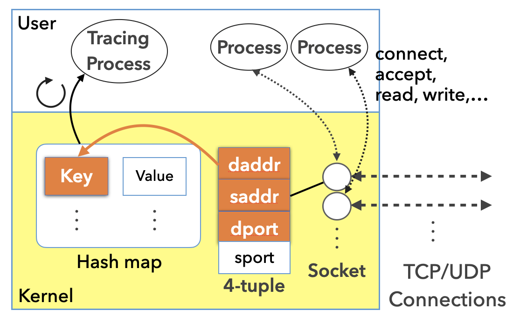

# go-conntracer-bpf

go-conntracer-bpf is a library for Go for tracing network connection (TCP) events (connect, accept) on BPF kprobe inspired by [weaveworks/tcptracer-bpf](https://github.com/weaveworks/tcptracer-bpf). go-conntracer-bpf is implemented on top of [libbpf](https://github.com/libbpf/libbpf), which is a representative C library for BPF included Linux kernel.

## Features

- Low-overhead tracing by aggregating connection events in kernel.
- BPF CO-RE (Compile Once – Run Everywhere)-enabled

## Prerequisites

### Compilation phase

- libbpf source code
- Clang/LLVM >= 9

### Runtime phase

- Linux kernel version >= 5.6 (due to batch ops to bpf maps)
- Linux kernel to be built with BTF type information. See <https://github.com/libbpf/libbpf#bpf-co-re-compile-once--run-everywhere>.

### Common to both phase

- libelf and zlib libraries

## Usage

- [godoc](https://godoc.org/github.com/yuuki/go-conntracer-bpf)

## Projects using go-conntracer-bpf

- [yuuki/shawk](https://github.com/yuuki/shawk)
